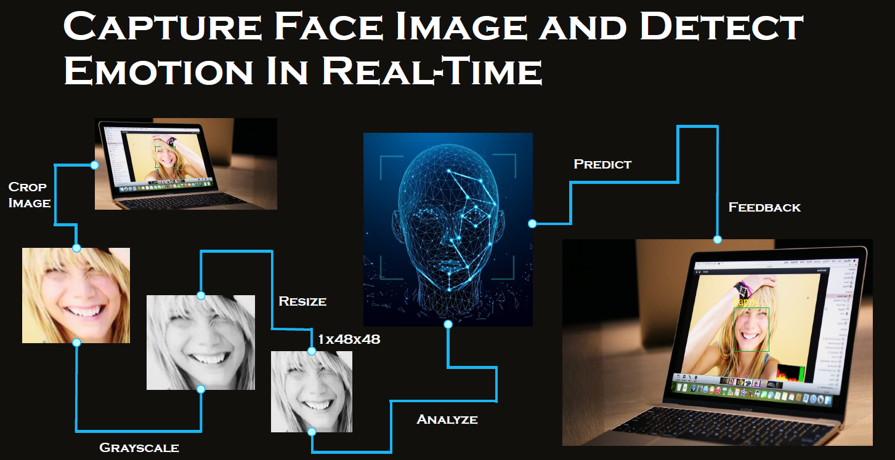

# Facial Expression Recognition in Real-Time
# 

● MTCNN + emotion recognition CNN (model trained by Kevin Chen)

● We used the code of MTCNN shared by Johnny AI tutorial

● Facial Expression Model (CNN) was trained manually(using Tensorflow) and got an accuracy of 87.2%. 

-------------------------------------------------------------------------------------------------------------------------

Johnny AI:

★ MTCNN is the abbreviation of Multi-task Cascaded Convolutional Networks. It performs face detection and alignment. The algorithm can be referred to the [link](https://arxiv.org/abs/1604.02878)

★ The github link of MTCNN auther is [here](https://github.com/kpzhang93/MTCNN_face_detection_alignment)

★ Python, openCV, pretrained MTCNN model, and a usb camera are used to execute real time face detection.

★ Johnny AI tutorial link is [here](https://youtu.be/moSY8odDQKE)
